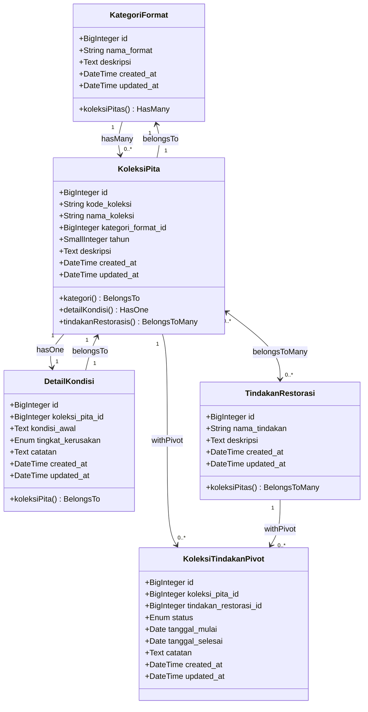

```mermaid
classDiagram
    class KategoriFormat {
        +BigInteger id
        +String nama_format
        +Text deskripsi
        +DateTime created_at
        +DateTime updated_at
        +koleksiPitas() HasMany
    }

    class KoleksiPita {
        +BigInteger id
        +String kode_koleksi
        +String nama_koleksi
        +BigInteger kategori_format_id
        +SmallInteger tahun
        +Text deskripsi
        +DateTime created_at
        +DateTime updated_at
        +kategori() BelongsTo
        +detailKondisi() HasOne
        +tindakanRestorasis() BelongsToMany
    }

    class DetailKondisi {
        +BigInteger id
        +BigInteger koleksi_pita_id
        +Text kondisi_awal
        +Enum tingkat_kerusakan
        +Text catatan
        +DateTime created_at
        +DateTime updated_at
        +koleksiPita() BelongsTo
    }

    class TindakanRestorasi {
        +BigInteger id
        +String nama_tindakan
        +Text deskripsi
        +DateTime created_at
        +DateTime updated_at
        +koleksiPitas() BelongsToMany
    }

    class KoleksiTindakanPivot {
        +BigInteger id
        +BigInteger koleksi_pita_id
        +BigInteger tindakan_restorasi_id
        +Enum status
        +Date tanggal_mulai
        +Date tanggal_selesai
        +Text catatan
        +DateTime created_at
        +DateTime updated_at
    }

    KategoriFormat "1" --> "0..*" KoleksiPita : hasMany
    KoleksiPita "1" --> "1" KategoriFormat : belongsTo
    KoleksiPita "1" --> "1" DetailKondisi : hasOne
    DetailKondisi "1" --> "1" KoleksiPita : belongsTo
    KoleksiPita "1" --> "0..*" KoleksiTindakanPivot : withPivot
    TindakanRestorasi "1" --> "0..*" KoleksiTindakanPivot : withPivot
    KoleksiPita "0..*" <--> "0..*" TindakanRestorasi : belongsToMany
```
