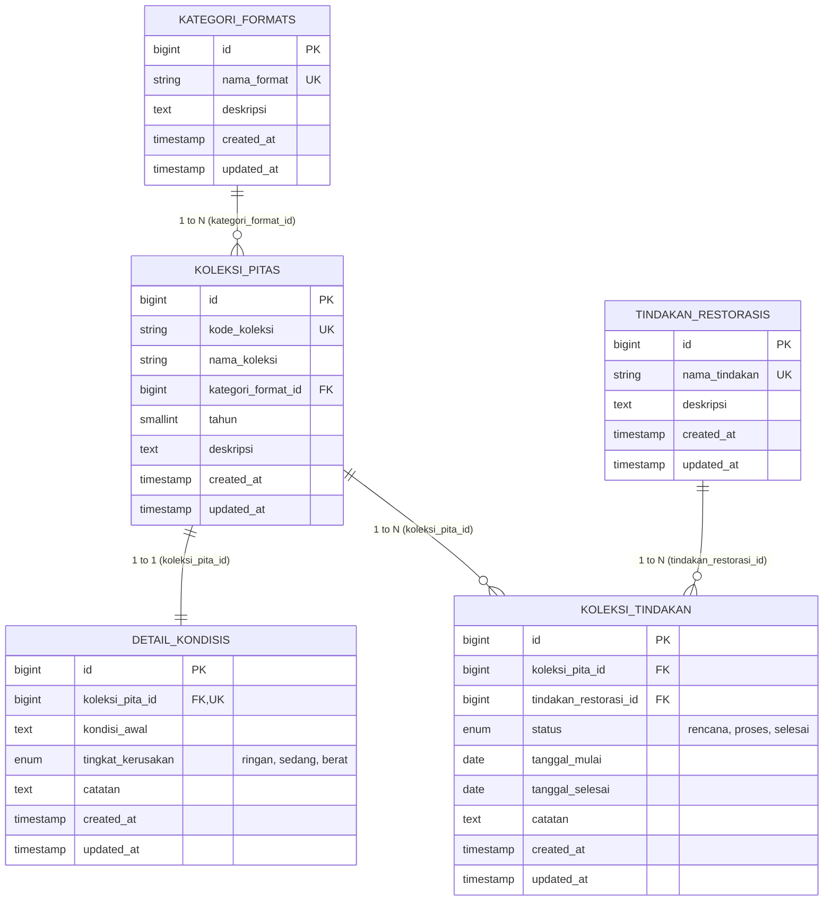

```mermaid
erDiagram
    KATEGORI_FORMATS ||--o{ KOLEKSI_PITAS : "1 to N (kategori_format_id)"
    KOLEKSI_PITAS ||--|| DETAIL_KONDISIS : "1 to 1 (koleksi_pita_id)"
    KOLEKSI_PITAS ||--o{ KOLEKSI_TINDAKAN : "1 to N (koleksi_pita_id)"
    TINDAKAN_RESTORASIS ||--o{ KOLEKSI_TINDAKAN : "1 to N (tindakan_restorasi_id)"

    KATEGORI_FORMATS {
        bigint id PK
        string nama_format UK
        text deskripsi
        timestamp created_at
        timestamp updated_at
    }

    KOLEKSI_PITAS {
        bigint id PK
        string kode_koleksi UK
        string nama_koleksi
        bigint kategori_format_id FK
        smallint tahun
        text deskripsi
        timestamp created_at
        timestamp updated_at
    }

    DETAIL_KONDISIS {
        bigint id PK
        bigint koleksi_pita_id FK,UK
        text kondisi_awal
        enum tingkat_kerusakan "ringan, sedang, berat"
        text catatan
        timestamp created_at
        timestamp updated_at
    }

    TINDAKAN_RESTORASIS {
        bigint id PK
        string nama_tindakan UK
        text deskripsi
        timestamp created_at
        timestamp updated_at
    }

    KOLEKSI_TINDAKAN {
        bigint id PK
        bigint koleksi_pita_id FK
        bigint tindakan_restorasi_id FK
        enum status "rencana, proses, selesai"
        date tanggal_mulai
        date tanggal_selesai
        text catatan
        timestamp created_at
        timestamp updated_at
    }
```
